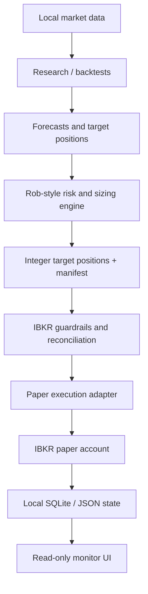
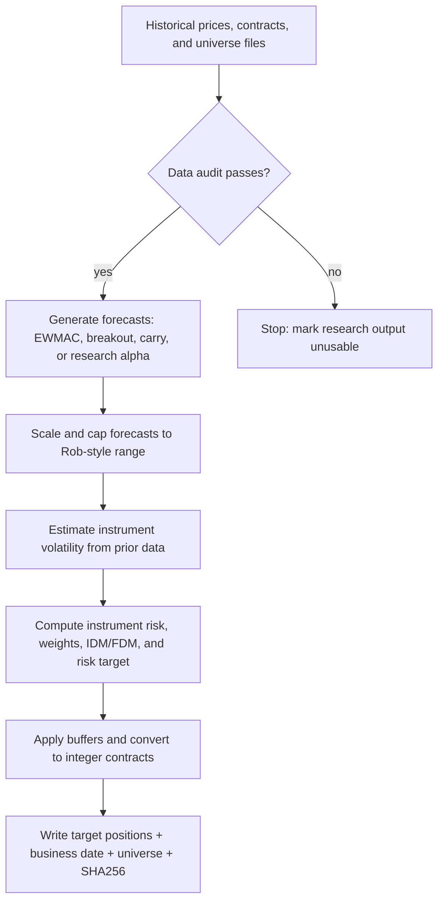
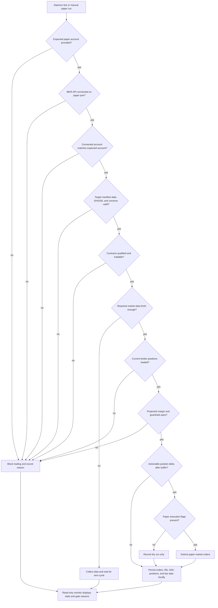
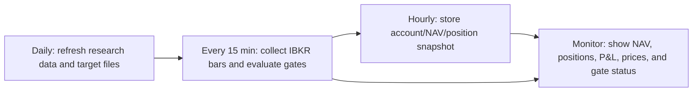

# Carver-Style Systematic Trading Lab

A clean research and paper-trading workspace for Robert Carver style systematic
futures and cross-sectional equity experiments.

The project is designed around one rule:

```text
Research can change forecasts.
The risk engine and broker adapter must stay explicit, testable, and separate.
```

This repository is not affiliated with Rob Carver or Interactive Brokers. It is
research code, not financial advice, and not a turnkey live-trading product.

## What This Is

This repo contains a compact systematic trading stack with four clear layers:

| Layer | Purpose | Can place orders? |
| --- | --- | --- |
| Research and backtests | Test universes, forecasts, regimes, costs, and portfolio behavior | No |
| Strategy engine | Apply Rob-style volatility estimation, forecast scaling, instrument risk, IDM/FDM, buffering, and integer positions | No |
| IBKR adapter | Reconcile approved targets against an IBKR paper account and hard safety gates | Paper only by explicit confirmation |
| Monitor UI | Read-only account, NAV, position, data freshness, and gate status display | No |

## System Boundary



The neural-network and stock alpha modules are forecast research only. They do
not set leverage, capital allocation, volatility target, instrument weights, or
execution rules directly.

## Trading Flow

The system has two separate flows: an offline research/engine flow that produces
target positions, and a broker adapter flow that decides whether those targets
are safe to execute in an IBKR paper account.

### 1. Research To Target Positions



The research path never connects to IBKR. Its job is to answer what the strategy
would like to hold, not whether the broker account can trade it right now.

### 2. Paper Execution Decision Tree



The adapter is deliberately conservative. A stale target file, wrong account,
missing data, failed contract qualification, margin breach, or missing
confirmation flag results in no order.

### 3. Runtime Cadence



## Repository Map

```text
cross_sectional_nn/       Cross-sectional forecast research modules
scripts/                  Backtests, diagnostics, data loaders, IBKR adapters
config/                   Non-secret guardrail config and sanitized templates
config/launchagents/      Safe LaunchAgent templates only
ibkr-monitor-prototype/   Read-only React monitor
docs/                     Architecture and operational boundaries
tests/                    Leakage, safety, persistence, and engine-boundary tests
```

Local research artifacts are intentionally ignored and are not part of the
public repository:

```text
data/
backtests/
research/
reports/
notes/
output/
env/
.env*
*.sqlite
*.db
*.log
```

## Quick Start

Create an environment with the packages used by the research scripts, then run
the unit tests:

```bash
python3 -m pip install -U pytest pandas numpy scipy scikit-learn matplotlib requests
pytest -q
```

Some data-gate tests skip automatically when the local point-in-time universe
data is not present. On a research machine with the local data directory
restored, those same tests become strict survivorship-bias checks.

## Backtest Examples

Backtests are offline. They do not connect to IBKR and must not read broker
state.

```bash
python3 scripts/run_minimal_ewmac_backtest.py
python3 scripts/run_rob_style_no_equity_40_backtest.py
python3 scripts/run_no_equity_40_margin_constrained_backtest.py
python3 scripts/run_ibkr_capacity_stress.py
```

Stock and cross-sectional research lives in the same offline path:

```bash
python3 scripts/run_equity_alpha_data_audit.py
python3 scripts/run_equity_alpha_signal_lab.py
python3 scripts/run_cross_sectional_nn_forecast.py
```

## IBKR Paper Adapter

IBKR code is an adapter around already generated targets. It is not the research
engine.

Paper-mode scripts require an explicit expected account:

```bash
export IBKR_EXPECTED_ACCOUNT="YOUR_PAPER_ACCOUNT"
python3 scripts/ibkr_connection_smoke.py --port 4002
python3 scripts/ibkr_contract_qualification.py
python3 scripts/ibkr_market_data_gate.py
python3 scripts/ibkr_historical_bar_gate.py --all
python3 scripts/ibkr_strategy_order_dry_run.py
```

Order transmission requires additional explicit confirmation flags. The
committed LaunchAgent is only a template and is safe by default; it does not
enable trading.

Read the boundary before touching broker code:

- [IBKR Paper/Live Boundary](docs/IBKR_PAPER_LIVE_BOUNDARY.md)
- [Architecture](docs/ARCHITECTURE.md)
- [GitHub Hygiene Audit](docs/GITHUB_HYGIENE_AUDIT.md)

## Data Policy

The repository does not include private market data, broker snapshots, order
logs, fills, account values, screenshots, API keys, or local reports.

Data loaders are included where useful, but generated datasets remain local.
This is deliberate: public source code should be reproducible in structure
without publishing account state or licensed/private data.

## Safety Features

- IBKR account identity is never hard-coded.
- Paper execution requires explicit confirmation flags.
- Live execution is not enabled by any committed template.
- Target integrity is checked by business date, universe size, and SHA256.
- Historical 15-minute bar collection can persist to local SQLite.
- Monitor UI is read-only.
- Sensitive runtime folders are ignored by Git.

## Validation

Useful checks before publishing or running experiments:

```bash
pytest -q
python3 -m py_compile scripts/ibkr_historical_bar_gate.py scripts/ibkr_paper_daemon.py
npm --prefix ibkr-monitor-prototype run build
```

The current public-clean snapshot was validated with:

```text
26 passed, 2 skipped
```

The two skipped tests require local point-in-time universe files that are not
published in this repository.

## Upstream References

- Rob Carver's system overview: <https://qoppac.blogspot.com/2021/12/my-trading-system.html>
- `pysystemtrade`: <https://github.com/pst-group/pysystemtrade>

## License

No license file is currently included. Until one is added, all rights are
reserved by the repository owner.
