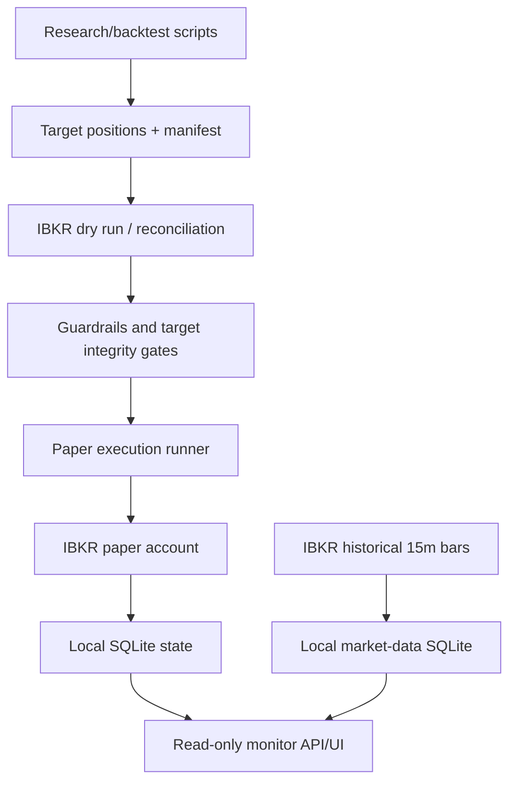

# Architecture

This project has three separate layers. Keep them separate when researching,
running backtests, or connecting IBKR.

## 1. Research And Backtest Path

Purpose: test ideas, generate diagnostics, and produce target-position files.

Main paths:

- `scripts/run_*backtest.py`
- `scripts/compare_*.py`
- `scripts/run_stock_*.py`
- `scripts/run_cross_sectional_nn_forecast.py`
- `cross_sectional_nn/`
- local-only `backtests/`, `research/`, `reports/`, `data/`

Rules:

- No IBKR socket connection.
- No order placement.
- No account, margin, open-order, or fill dependency.
- No live broker state as model input.
- Outputs are research artifacts, not execution authority.

Typical output:

- portfolio daily returns
- positions or target positions
- diagnostics and charts
- target manifest for downstream review

## 2. Strategy Engine Boundary

Purpose: preserve the Robert Carver style risk and sizing system.

The strategy engine boundary is:

```text
prices / forecasts
-> Rob-style volatility estimation
-> forecast scaling
-> instrument risk calculation
-> instrument weights / diversification
-> volatility targeting
-> integer position targets
```

Research may change forecasts or universes, but should not silently change:

- volatility estimator
- forecast scale/cap
- risk target
- diversification multiplier / IDM
- instrument weights
- transaction cost assumptions
- integer position logic
- portfolio aggregation

When the engine is intentionally changed, document it as an engine change, not
as a forecast experiment.

## 3. IBKR Paper/Live Adapter Path

Purpose: connect strategy targets to IBKR paper infrastructure with hard gates.

Main paths:

- `scripts/ibkr_connection_smoke.py`
- `scripts/ibkr_contract_qualification.py`
- `scripts/ibkr_market_data_gate.py`
- `scripts/ibkr_historical_bar_gate.py`
- `scripts/ibkr_strategy_order_dry_run.py`
- `scripts/ibkr_paper_strategy_runner.py`
- `scripts/ibkr_paper_daemon.py`
- `config/ibkr_paper_live_guardrails.yaml`
- `config/launchagents/*.plist.template`

Rules:

- IBKR scripts are adapters, not research engines.
- Paper execution requires explicit paper account identity.
- Order transmission requires explicit confirmation flags.
- Runtime state is local-only under ignored `output/` and `data/`.
- Concrete LaunchAgent plists are local machine files and are not committed.

Current implementation is paper-first. Live trading must be a separate,
reviewed deployment path.

## 4. Read-Only Monitor

Purpose: observe account, positions, gate status, data freshness, and local
price overlays.

Main path:

- `ibkr-monitor-prototype/`

Rules:

- No execution controls in the UI.
- The monitor may show broker/account values and local marks.
- The monitor must not be treated as the source of target positions.

## 5. Data Flow



## 6. Directory Policy

Committed:

- source code
- tests
- docs
- sanitized templates

Ignored/local-only:

- credentials
- raw data
- SQLite databases
- IBKR account/fill/order state
- generated reports
- generated backtests/research outputs
- screenshots
- cloned upstream repos
- node modules and build output

## 7. Operational Rule

If a file can reveal account identity, API keys, local machine paths, broker
orders, fills, NAV, or private runtime state, it should be local-only unless it
has been explicitly sanitized.
